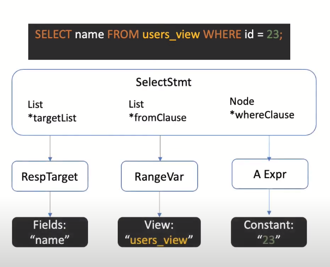
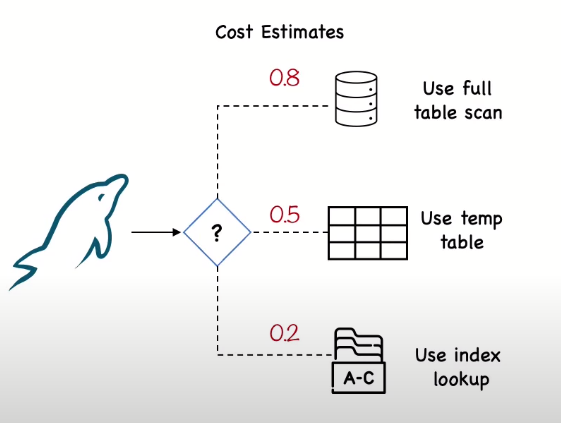
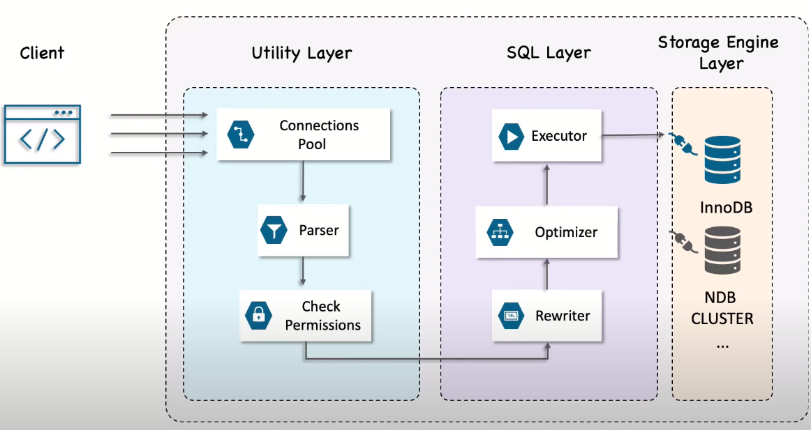

## MySQL Architecture
Mysql is very different from other database servers and,
as its architectural characteristics make it useful for a wide range of purposes.
It's flexible enough to work well in very demanding environments,
e.g., web apps, data warehouse, online transactions. 
To get the most of MySQL, you should understand well its design so to work with it not against it. 

MySql server is divided into three layers as shown below.
The first layer contains the services that are not unique to MySQL: connection handling, authentication, security, and so for.
The client server protocol makes MySQL communication simple and fast, but it is limited as there is no flow control.
Once one side sends a message, the other side must fetch the entire message before responding.
This is why `limit` clauses are so important. 

The default behavior for most libraries when connecting to mysql is to
fetch the whole result and buffer it in memory. Until the all rows is being fetched,
MySQL server will not release the logs and other resources required by the query. 

After handling the connection, mysql parser breaks the query into tokens and
builds a [parse tree](img/parse_tree_example.png) from the query parts.
Parser uses `sql` grammar to interpret and validate the query. Next, the preprocessor checks the privileges. 

    

The second layer included the much more brain of MySQL, e.g.,
query analysis, optimization, and all the built-in functions for dates, map operation, encryption, and so forth. 
To begin, The `Rewrite` component will write the query again if it is necessary based on some mysql rules,
e.g., if the query contains a `view` the system rewrite the query to access the base table in the wanted view. 
Here, the query is valid and ready for the `optimizer` to turn it into a **query excuation plan**.
I talked about MySQL various excuation plans in the previous section.
Take a look at these [plans' cost estimation](img/mysql_plans_cost_estimation.png). 

    

<h4 align="center">MySQL Architecture</h4>

The third layer contains the storage engines, they are responsible for storing and retrieving all data stored in mysql.
They are implemented as plugins which make it relatively easy to switch the way to handle the data.
InnoDb is the default storage engine for MySQL.

    

<h4 align="center">MySQL Architecture</h4>

