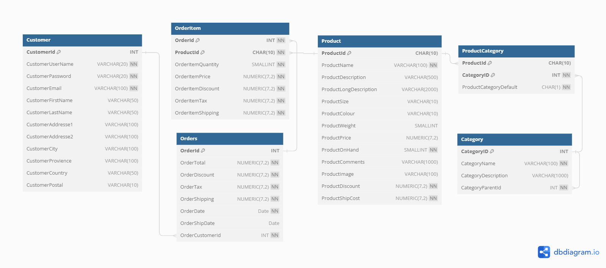
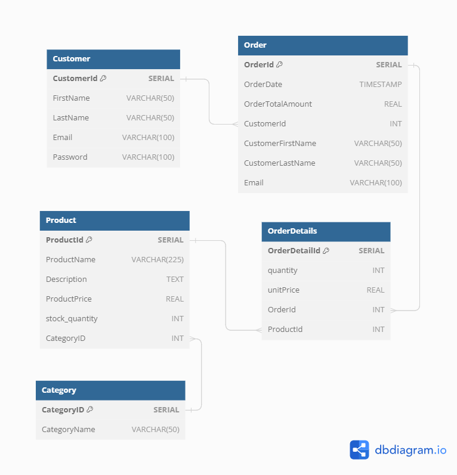
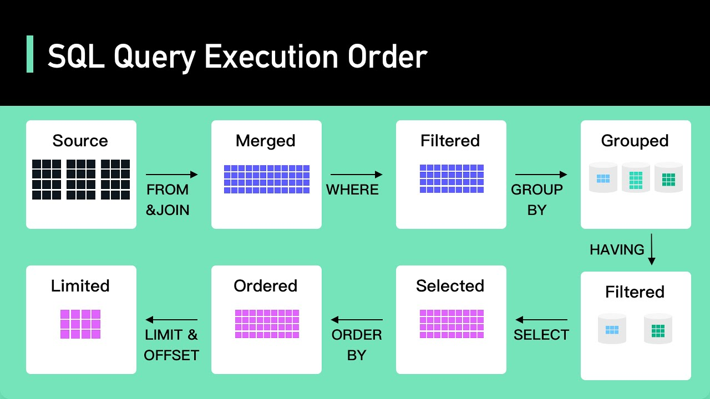
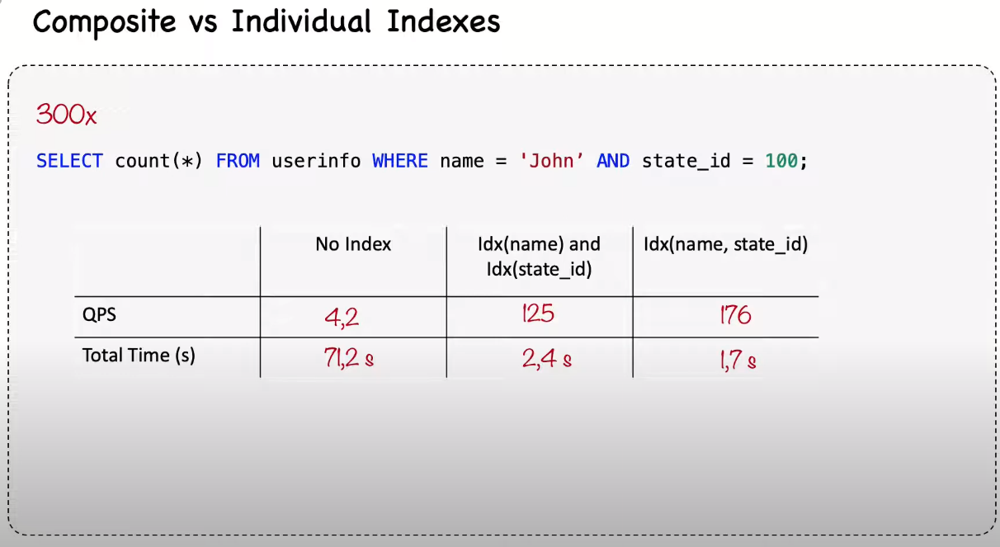
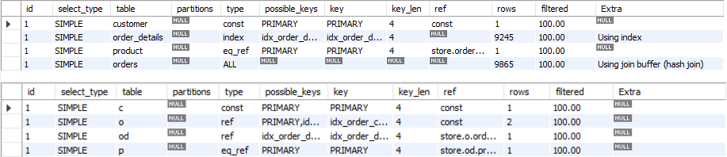

# Practical Web DataBase Design [Book](https://link.springer.com/book/10.1007/978-1-4302-5377-8)
This `README` file contains my hand-work from database concepts discussed in the book.
Also, I Implemented the applications described in the book as an illustrative example.<br>
The Repository is a part of collaborative work production in 
a [6-Month Mentorship program](https://t.me/ta5rif_mj/253) under the supervision of [Eng.Ahmed Emad](https://www.linkedin.com/in/ahmed-emad-abdelall/).

## Index:
- [An Intro to the content of the book](#book-content)
- [Book Example Design and Impl in MySql & PostgresSql](#book-e-commerce-example)
- [Ecommerce Application Design](#my-hands-on-e-commerce-app-design)
  * [DeNormalized ERD Design](#denormalized-design)
- [Some Common Queries, e.g., top-selling products And Daily or Monthly Reports](#important-queries)
- [MySQL DataBase Performance Tuning](#database-performance-tuning)
  - [Using `explain` keyword for query Optimization](#using-explain-keyword-for-query-optimization)
  - [Indexes performance and best-practices](#index-performance-covering-index-and-composite-index-key-best-practices)
  - [Comparison Some Queries before and after using performance techniques](#queries-optimization-example-using-explain-analyze-before-and-after-rewriting-the-queries)
  - [MySQL Architecture](MySQL.md)
- [The Tools which I used In the project](#tools)
  
### Book Content
Practical web database design is a great text book that had written by experienced professional engineers.
They made an insightful database work consists of Nine chapters and Appendix.
On Their first words, They gave us a good introduction about database definition, 
a short history about how we start thinking for `files` alternative, what is the DBMS and its models, 
and is there a database on the web? if so, how about using it in web application.  
After that, The author discussed core database concepts, e.g., Data model, Relational Model and 
how it consists of `Tables`, `Rows`, `Columns`, The Domains and data types.
They explained data model constrains and how to use primary keys and foreign keys in a wise DB Model Design.<br>

At the End of Ch.2, He talked about `Normalization`, `Indexs`, `Data Integrity`.
The book explained five normalization forms with good examples, Physical data access methods, e.g.,
sequential access, direct access, indexed access, and data integrity rules.<br>

After that we are seeing the author talking about `Sql` history, and it's categories.
What is Data Definition Language(DDL), DML, Querying using `Select`, `WHERE`, `HAVING`, and `JOIN` clauses.
The Book has a good E-commerce example for these concepts started from ch.3 till ch.7.<br>

when The Author intended to talk about Database Design Fundamentals, 
He gave us, At first, a solid academic definitions about data modeling, Model `Entities`,
its `attributes`, `Relationships`.
we found a well-described project to explain where to use OneToMany or ManyToMany, its recursive version,
and OneToOne Relationships.<br>

The End of ch.4 is a brilliant explanation about `DeNormalization` for Performance purposes.<br>

I found chapter five in this book is a legend for every software engineer and business owner. 
These insightful papers gave us the guide from A~Z in System design process.
How to start the process with the owner and customer, what are the questions to ask them about,
so you can get your goal obvious.<br>
After **Gathering Information**, we can step into Identifying System Entities, Attributes, Relationships. 
Ending By preparing your conceptual data model.<br>

In the end, the author addresses advanced database features
- Sub-Queries
- Stored Procedures and Triggers
- Database Performance Tuning
- Types of Indexes, and Indexes best practices.
- Managing Concurrency: Locking and Transactions. <br>

Also, Book Authors address two main chapters about Database Security and Maintenance. 
These topics are more towards System Administration work, 
but it is good for us to know how to perform good security rules. 

### Book E-commerce Example

As I mentioned earlier, the author discussed in `Chapter.5` 
What is the SOLID steps to follow, so you can result a well-designed project.<br> 
The author strongly recommends to analysis system requirements firstly with the business owner 
and some possible customers by asking these questions(mentioned in`ch5`) 
for example we can ask about the kind of products will be sold? what information 
about the products must be maintained in the Database? How should the database store customer orders?
and other many questions, so you can estimate the size of the application and how far should we care in 
the design about performance or scalability.<br>
After Gathering system information from the business 
we can see that the system must contain products entity. 
The `Product` entity must contain every available information for various different 
products which are not in the same category. 
Here we can find it's reasonable to have a lot of `null` in the `product` entity.<br>

All other rest of system entities are described in the ERD Diagram below and those relationships.
I Implemented these `model` classes using `Java` , `Spring Data Jpa`. Take a look [here.](code/ecommerce_model_classes)  
I used postgreSQL to generate and test the Database, as you can access the `sql` code to create your Own schema from the system [from here.](code/sql/create_DB_schema_book_e_commerce.sql)

<p align="center">
    
</p>
<h3 align="center">E-Commerce ERD Diagram</h3>

### My Hands-On E-Commerce App Design
The app is e-commerce that has `Order`, `Product`, `Category`, and `Customer` Entities.<br>
* Customer can purchase many orders so it will be a `OneToMany` Relationship. 
As a One **Customer** linked to Many **Orders**.
* Products can be in many orders, also orders can have many products. 
So I linked them with `ManyToMany` Relationship: 
Here we have an associative Entity (**OrderDetails**)  
* Category always had many products. 
So it will be a one category linked to many products as `OneToMany` Relation
> You can Access a``SQL`` file for creating the database schema: [DB Schema.](code/sql/create_DB_Schema.sql) <br>
> Also, if you need to test the database design and queries listed below, you can use these [Fake Data.](code/sql/Fake_Data)

Here you can find [ERD Normalized](img/task_ERD_Normalized_01.jpg) Form of the app.<br>
### DeNormalized Design
when the customer creat an order, 
I need his/her email and full-name to notify him/her with an email containing the order details and shipping information.<br>
we need to **Denormalize** this design, so it would be easy for the Query to get customer info.
I added user-name and email to `Order` Entity
> Here is Redundant info, but **Better Performance**.
 <p align="center">
    
</p>
<h3 align="center">DeNormalized ERD Design</h3>

### Important Queries
* <h4>Daily Report</h4>
Business Owner wants a daily report of the total revenue for a specific date.
we can get the total revenue by get the summation of the `orderTotalAmount` for A specific `Order` where the date is `orderDate`
```mysql
SELECT SUM(ordertotalamount)
  FROM "Order" WHERE
  DATE(orderdate)='2023-09-09';          -- write specific date you want 
```
* <h4>Monthly Report </h4>
Business Owner wants a monthly report Of the top-selling products in a given month.
```mysql
SELECT DATE_FORMAT(orderdate,'%y-%m') AS Months, productId
  FROM orderdetails od JOIN 'Order' o ON o.orderId=od.OrderId
  (SELECT ProductName FROM product p where p.productId = od.productId, SUM(quantity)) As totalQuantity
  WHERE DATE_FORMAT(orderdate,'%y-%m') = '2023-10'
  GROUP BY DATE_FORMAT(orderdate,'%y-%m'), productid
  ORDER BY totalQuantity DESC
  ;
```
* <h4>List all customers who order in a month more than an amount of money.</h4>
Business Owner wants list Of customers who have placed orders totaling more than $500 in the past month.
```mysql
SELECT c. customerid, c. firstname, c. lastname
  FROM customer c JOIN "Order" o ON c.customerid = o.customerid
  WHERE o.orderdate DATE_TRUNC( 'month' , CURRENT_DATE -INTERVAL '1 month')
  AND o.order_date < DATE_TRUNC( 'month' , CURRENT_DATE)
  GROUP BY c. customerid, c. firstname, c. lastname
  HAVING SUM(o.totalamount > 500)       -- put the amount you want
;
```
* <h4>Search for all products with the word 'camera' in either the product_name or product_description.</h4>
searching is a fundamental feature for any website now, not only ecommerce,
so we should care about how fast it is and accurate for searching results
```mysql
select productid, productname,productname from product
where productname like 'camera' or productdescription like 'camera';
```
* <h4>Suggest popular products </h4>
  we need the customer to know what else we have he might be interested in,
  so when the customer is viewing a product, the system will suggest products from the similar category
```mysql
SELECT p.productname FROM product AS p
INNER JOIN category AS c ON p.categoryid = c.categoryid
WHERE p.categoryid = 
(SELECT categoryid FROM product WHERE productid = 'viewed_product_id')
AND p.productid <> 'viewed_product_id'                           -- select the viewed product id 
ORDER BY 
(SELECT COUNT(*) FROM orderdetails AS od WHERE od.productid = p.productid) DESC
LIMIT 5
;
```
* <h4>Trigger to Create a sale history</h4>
when the customer purchases a new order, create a history sale in the database for this customer. The sale history details may be order date, customer full name, products purchased in the order. The trigger should be triggered on the order insertion.
````mysql
# Create the sale history table if it doesn't exist

CREATE TABLE IF NOT EXISTS sale_history (
    sale_id INT AUTO_INCREMENT PRIMARY KEY,
    order_date DATE,
    customer_full_name VARCHAR(255),
    products_purchased TEXT
);
# Create the trigger

DELIMITER $$
CREATE TRIGGER CreateSaleHistory
AFTER INSERT ON orders
FOR EACH ROW
BEGIN
    INSERT INTO sale_history (order_date, customer_full_name, products_purchased)
    VALUES (NEW.order_date, CONCAT(NEW.customer_first_name, ' ', NEW.customer_last_name),
            NEW.products_ordered);
END;
$$
DELIMITER ;
````
* <h4>Transaction to lock a field</h4> 
write a transaction to lock quantity field with product id = 211 from being updated.<br>
And another transaction to lock the row.
```mysql
-- Lock the field quantity with product id = 211 
begin;
select quantity from product where productid = 211 ;
commit;
-- Lock the row with product_id = 211 for update
begin;
select * from product where productid = 211 for update;
commit;
```
### DataBase Performance Tuning
Performance tuning is a critical topic that every developer should care about.<br>
A subsection in `ch.8` of the book gives a quick look about database tuning, 
so I found it is a fundamental subject, and I need to deep dive into it.<br>
I listened to **MySQL Database Tuning** course on 
[YouTube](https://www.youtube.com/playlist?list=PLBrWqg4Ny6vXQZqsJ8qRLGRH9osEa45sw).<br>
For `MySQL` database engine, we will talk about :

#### Using `explain` keyword for query Optimization
> MySQL creates a query plan before each query

when I have a query to optimize, 
I'll `Analyize` why is it slow? or why it impacts the system too much?<br>
the main tool fo this is `explain` statement 
which provides information about <br>
**the query plan chosen by the optimizer 
and the optimizer has to make a few decisions before executing each query**<br>

If the client wants to fetch data from my database, we have 3 options for doing this:
1. Fetch the data directly from a table.
This is called **full scan**, it's normally works best for the small tables.
As it fetches all rows from the table and checks against the condition,
it's the worst time-response way to use!
2. Go to the `index` and stops here, because all required columns are in the index.
if it so, we have an `index covering`, the index is used to filter out `rows` then access these rows from the table,
usually this is the best time-response way to access a table, but this is less often a case exists.
3. Get the Records location from `index`, and go to the table to get the actual data.
 <p align="center">
    
</p>
<h3 align="center">MySQL Query Paths when fetch the data</h3>

If we have a slow `query`, the first thing to do is running it with `explain`. 
It shows the query plan, or you can say **the list things expected to happen when the query is executed**.<br>
If I run the query with `explain analyze`, we will get both the estimation of what the planner expected 
along with what happens when the query runs.
```mysql
explain select * from orders;
-- run with explain analyze 
explain analyze select * from orders;
-- show explain in json or tree format
explain format=json select * from product ;
-- show explain in tree format
explain format=tree select * from product ;
```
**Tips**:
 - pay attention to weather the estimates, and the actual cost differs from each other, 
 if there is a big difference, the optimizer is making poor decisions. 
 Running `analyze` table cause is a good thing to start.
 - when analyzing a query, we should care about `cache` it is **Hot** or **Cold**
 as it for sure affects the amount of time for the query.

> **Conclusion**:<br>
> explain analyze is a profiling tool for your queries that will
> reveal where mySQL spends time on the query and why?
> display the difference between planning vg actual execution

#### SQL Query Order Execution
Before any performance steps, It is important to pay attention to the **query execution order**.
As shown below, this is the order of executing a query statements:
<p align="center">
    
</p>

#### Index performance, covering index, and composite index key best-practices
[Multi-Column index](img/composite_index.png) is known also as a composite index.<br>
when querying data from a table, we can do this
with two conditions, and every column is index individually, Or we can index the two columns in a composite index.
Also, we can query the data with no index!
I'm testing in `userinfo` [table](code/sql/userinfo.sql)
```mysql
-- No index so mysql does a full coverage here and took long time response
explain analyze select count(*) from userinfo where name = 'John100' and state_id = 100;

-- create individual index 
-- use analyze table and you'll find it's much faster now
alter table userinfo add index name_idx(name);
alter table userinfo add index state_id_idx(state_id);

-- drop the two column indexes 
drop index name_idx(name);
drop index state_id_idx(state_id);

-- create the composite index
alter table userinfo add index name_state_idx(name,state_id);
```
The benchmark time result from comparing these indexes' options is :
<p align="center">
    
</p>

Redundant indexes are not a good thing to keep in your schema. 
Use this simple query to know what Redundant you have 
```mysql
select * from sys.schema_redundant_indexes\G;
```
> you can access the [python script](code/data_generate.py) that I used to generate one million fake data.
>, also another [script](code/benchmark.py) for benchmark testing.

#### A Query to retrieve the products related to an order which a specific customer purchased
It is a common use case in all ecommerce websites, 
so I applied it to our example that I mentioned it the top of this page aganist a 10k records and I tried to optimize its performance
```mysql
select  c.customer_id,
        c.first_name,
        c.last_name,
        o.order_id,
        o.total_amount,
        p.product_id,
        p.name
from customer c join 
    (orders o join
    (order_details od join
        product p on od.product_id = p.product_id)
    )
where c.customer_id=500;  -- select the specific customer you want 
```
Here in that query,It worked and returned me the desired output. 
And for curious purposes I executed the query with `explain` keyword, and here is the bad news as 
I found it's not efficient.
For 10k rows, it covers almost all the row(9250 rows). I can see it is full coverage, 
It is very strange because most of the columns are primary and foreign keys, so it's typically indexed.
After thinking about the issue, I tried to reduce the number of joins. <br>
```mysql
# I have nested JOINs, which can be optimized by breaking them into separate queries.
# This can reduce the complexity and improve readability.

select c.customer_id,
       c.first_name,
       c.last_name,
       o.order_id,
       o.total_amount,
       p.product_id,
       p.name
from customer c
    join orders o on c.customer_id = o.customer_id
    join order_details od on o.order_id = od.order_id
    join product p on od.product_id = p.product_id
where c.customer_id=500;
```
The result has Blown up my mind, it covers only (2) rows for maximum. 
using `explain` we'll get this.so Take a look at the results down here: 

<p align="center">
    
</p>

#### Queries Optimization Example using `explain analyze` before and after rewriting the queries

1. Retrieve the total number of products in each category.
2. Find the top customers by total spending.
3. List products that have low stock quantities of less than 10 quantities.
4. Calculate the revenue generated from each product category.

| The Query                                                                                                                                                                                                                   |  Time  | Optimization Technique                                                                                 | Rewrite Query                                                                                                                                                                                            |  Time  |
|-----------------------------------------------------------------------------------------------------------------------------------------------------------------------------------------------------------------------------|:------:|--------------------------------------------------------------------------------------------------------|----------------------------------------------------------------------------------------------------------------------------------------------------------------------------------------------------------|:------:|
| `select cat.category_name, count(p.product_id) as totalproducts from product p join category cat on cat.category_id=p.category_id GROUP BY cat.category_id ORDER BY totalproducts DESC;`                                    | 57 ms  | create an index on `product` for the category id and change the grouping attribute to `category_name`  | `create index idx_category_id on product(category_id);`                                                                                                                                                  | 41 ms  |
| `select c.first_name, c.last_name, o.order_id,o.total_amount from customer c join orders o on c.customer_id = o.customer_id where  o.total_amount = (SELECT MAX(total_amount) from orders);`                                | 1.9 ms | using `ORDER BY` and `LIMIT` instead of using `MAX` and index `total_amount` column                    | `SELECT c.first_name, c.last_name, o.order_id, SUM(o.total_amount) as totalAmountFinal FROM customer c JOIN orders o ON c.customer_id = o.customer_id ORDER BY totalAmountFinal DESC LIMIT 1;`           | .7 ms  |
| `select p.product_id,p.name,p.stock_quantity from product p where stock_quantity<10;`                                                                                                                                       | 1.9 ms | create index of `stock_quantity`                                                                       | `create index idx_quantity on product (stock_quantity);`                                                                                                                                                 | 1.7 ms |
| `SELECT p.category_id, cat.category_name, SUM(p.price) as total_price FROM product p JOIN category cat ON p.category_id = cat.category_id WHERE cat.category_name = 'category1' GROUP BY p.category_id, cat.category_name;` | 1.6 ms | Avoid Unnecessary Columns in `GROUP BY`                                                                | `SELECT p.category_id, cat.category_name, SUM(p.price) as total_price FROM product p JOIN category cat ON p.category_id = cat.category_id WHERE cat.category_name = 'category1' GROUP BY p.category_id;` | 1.5 ms |

If you want to access a good recap overview of what
I learned in my database journey with the book and my mentor advices,
I posted [here](Database_Mentorship_Program.png) a one flow chart page containing all of my learning

### Tools
- [Intellij IDEA Ultimate](https://www.jetbrains.com/idea/)
- [DB Diagram](https://dbdiagram.io/)
- [PostgreSQL Pgadmin4](https://www.pgadmin.org/)
- [MySQL WorkBench](https://www.mysql.com/products/workbench/)